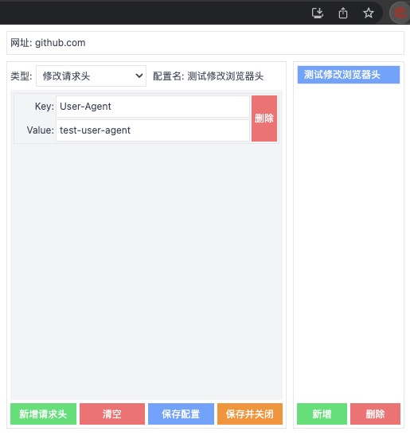
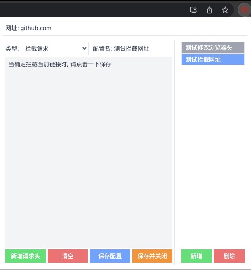
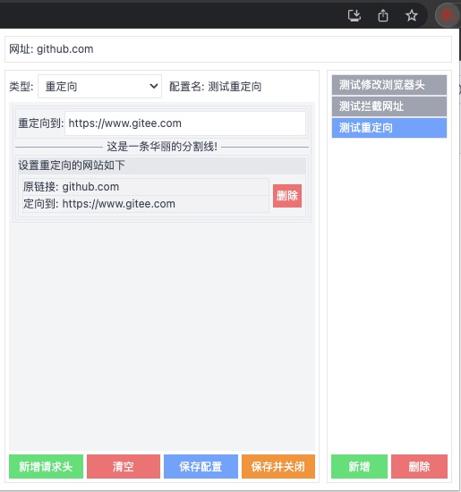

# EasyModHeader

EasyModHeader 是一个强大且易用的浏览器扩展程序，它能使用户可以更方便地管理多个网站多个配置的请求头信息。

## 功能

- [x] **修改请求头**: 用户可以方便地添加、修改或删除任何网页的 HTTP 请求头。
- [x] **多网站管理**: 提供了一种简单的方式来管理多个网站的请求头，用户可以为每个网站设置不同的请求头信息。
- [x] **多配置管理**: 提供了多个配置, 用户可以为单个网站生成不同的配置, 方便用户管理单个网站的请求头信息。
- [x] **易用的界面**: 提供了一个更直观、更用户友好的界面。
- [ ] **导入/导出配置**: 用户可以轻松地导入或导出他们的配置，方便在不同的设备或浏览器之间同步设置。

## 使用范围

1. 修改请求头
2. 拦截请求
3. 重定向

## 使用方法

1. 安装 EasyModHeader 后，点击浏览器工具栏上的 EasyModHeader 图标打开主界面。
2. 在选择好使用范围后, 根据提示输入您想输入的数据, 点击保存即可。

## 截图

## 感谢

- [Antfu](https://github.com/antfu) 感谢Antfu大佬提供的扩展程序模板, 向Antfu大佬致敬
- [ModHeader](https://chrome.google.com/webstore/detail/modheader-modify-http-hea/idgpnmonknjnojddfkpgkljpfnnfcklj?hl=zh-CN) 感谢提供思路
- [Vue.js](https://cn.vuejs.org/) 感谢提供框架
